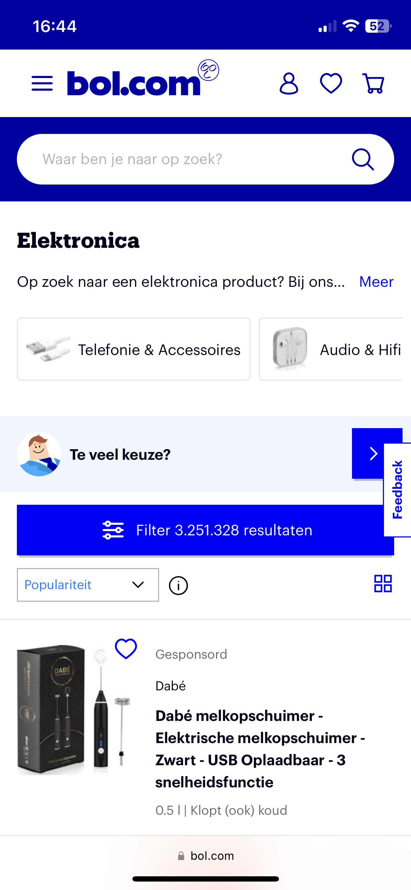

# Procesverslag
Markdown is een simpele manier om HTML te schrijven.  
Markdown cheat cheet: [Hulp bij het schrijven van Markdown](https://github.com/adam-p/markdown-here/wiki/Markdown-Cheatsheet).

Nb. De standaardstructuur en de spartaanse opmaak van de README.md zijn helemaal prima. Het gaat om de inhoud van je procesverslag. Besteedt de tijd voor pracht en praal aan je website.

Nb. Door *open* toe te voegen aan een *details* element kun je deze standaard open zetten. Fijn om dat steeds voor de relevante stuk(ken) te doen.

## Jij

  
uitwerken voor kick-off werkgroep

  ### Auteur:
  Brianne de Deugd

  #### Je startniveau:
  Rood

  #### Je focus:
  Responsive
 

## Je website

  
uitwerken voor kick-off werkgroep

  ### Je opdracht:
  link naar de website die je gaat namaken óf de naam/omschrijving van je eigen ontwerp

  #### Screenshot(s) van de eerste pagina (small screen): 
  BOL.COM - homepagina  
  

  #### Screenshot(s) van de tweede pagina (small screen):
  BOL.COM - elektronica  
  
 

## Toegankelijkheidstest 1/2 (week 1)

  
uitwerken na test in 1e werkgroep

  ### Bevindingen
  Lijst met je bevindingen die in de test naar voren kwamen:

  #### Screenreader
  Op Bol.com zijn er wel heel veel koppen, omdat elke knop (zoals de categorieën) als kop wordt beschouwd. Daardoor duurt het heel lang om te navigeren door de gehele homepagina.

  Koppen kunnen als links worden beschouwd als ze verwijzen naar een andere pagina zoals de categorieën. In dat geval heb je een kop 'categorieën' en kan de gebruiker zelf kiezen of ze deze allemaal opgelezen willen of niet.

  #### Muis en Toetsenbord 
  Met tab kan je op bol.com alles selecteren, maar er is geen manier om dropdowns 'down' te laten 'droppen'. Ook kan je met tab niet teruggaan, dus als je per ongeluk twee keer op tab kunt heb je geen manier om terug te gaan.

  Tab moet gebruiksvriendelijker dan het nu is. Hoe kan je elementen uitvouwen? Hoe kan je terug? Etc.

  #### Motoriek (shocks, elastiekjes)
  Door de shocks duurde het heel lang om de vinger op de juiste knop te krijgen. Je bent constant bezig met wat er gebeurt in je lichaam, waardoor je focus verliest als het gaat om het behalen van je doel, je wordt tegengehouden van de dingen die je wil doen.

  Hier een omschrijving van hoe het opgelost kan worden (met indien nodig afbeeldingen)

  #### Visueel (brillen, contrast, kleurenblind, dark/light). 
  Hemifield Loss - je denkt alles te zien, maar dat is niet zo. In eerste instantie lijkt het of er geen verschil is. Maar je mist van alles.

  Peripheral Field Loss - je kijkt eigenlijk letterlijk door een notendop, dus in plaats van dat je je ogen beweegt, moet je wel je hoofd bewegen. Bol heeft veel grote elementen met tekst die over een groot deel van de breedte spreid, waardoor je beter en langer moet lezen. Dit kan opgelost worden door meer gebruik te maken van kolommen.

  Low Contrast - geeft veel hoofdpijn, en laat alleen globale kleuren zien. Wel heb je soms roze vlakken met blauwe tekst erop, dat is nauwelijks te lezen. 

  Al in al kunnen er meer kolommen gebruikt worden zodat meer elementen in één opslag te vinden/bekijken zijn. Ook mag het contrast veel hoger in geval van kleurenblindheid.

## Breakdownschets (week 1)

  
uitwerken na afloop 2e werkgroep

  ### de hele pagina: 
  

  ### dynamisch deel (bijv menu): 
  

  ### wellicht nog een dynamisch deel (bijv filter): 
  

## Voortgang 1 (week 2)

  
uitwerken voor 1e voortgang

  ### Stand van zaken
  hier dit ging goed & dit was lastig (neem ook screenshots op van delen van je website en code)

  ### Agenda voor meeting
  samen met je groepje opstellen

  | student 1      | student 2          | student 3    | student 4        |
  | ---            | ---                | ---          | ---              |
  | dit bespreken  | en dit             | en ik dit    | en dan ik dat    |
  | en dat ook nog | dit als er tijd is | nog een punt | dit wil ik zeker |
  | ...            | ...                | ...          | ...              |

  ### Verslag van meeting
  hier na afloop snel de uitkomsten van de meeting vastleggen

  - punt 1
  - punt 2
  - nog een punt
  - ...

## Voortgang 2 (week 3)

  
uitwerken voor 2e voortgang

  ### Stand van zaken
  Flexbox en order ging goed. Ook scrollen binnen containers, custom forms etc.
  
  

  ### Agenda voor meeting

  | Brianne                        | student 2                | student 3                | student 4                |
  | ---                            | ---                      | ---                      | ---                      |
  | Ik kan niet altijd :nth-of-    | ...                      | ...                      | ...                      |
  | child gebruiken. Bijv. als ik  | ...                      | ...                      | ...                      |
  | de 1e section een background-  | ...                      | ...                      | ...                      |
  | image wil geven. Wat moet ik   | ...                      | ...                      | ...                      |
  | dan doen? (zelfde met links)   | ...                      | ...                      | ...                      |        

  ### Verslag van meeting
  hier na afloop snel de uitkomsten van de meeting vastleggen

  - punt 1
  - punt 2
  - nog een punt
- ...

## Toegankelijkheidstest 2/2 (week 4)

  
uitwerken na test in 8e werkgroep

  ### Bevindingen
  Lijst met je bevindingen die in de test naar voren kwamen (geef ook aan wat er verbeterd is):

  #### Screenreader
  Hier korte omschrijving (met indien nodig afbeeldingen)

  Hier een omschrijving van hoe het opgelost kan worden (met indien nodig afbeeldingen)

  #### Muis en Toetsenbord 
  Hier korte omschrijving (met indien nodig afbeeldingen)

  Hier een omschrijving van hoe het opgelost kan worden (met indien nodig afbeeldingen)

  #### Motoriek (shocks, elastiekjes)
  Hier korte omschrijving (met indien nodig afbeeldingen)

  Hier een omschrijving van hoe het opgelost kan worden (met indien nodig afbeeldingen)

  #### Visueel (brillen, contrast, kleurenblind, dark/light). 
  Hier korte omschrijving (met indien nodig afbeeldingen)

  Hier een omschrijving van hoe het opgelost kan worden (met indien nodig afbeeldingen)

## Voortgang 3 (week 4)

  
uitwerken voor 3e voortgang

  ### Stand van zaken
  hier dit ging goed & dit was lastig (neem ook screenshots op van delen van je website en code)

  ### Agenda voor meeting
  samen met je groepje opstellen

  | student 1      | student 2          | student 3    | student 4        |
  | ---            | ---                | ---          | ---              |
  | dit bespreken  | en dit             | en ik dit    | en dan ik dat    |
  | en dat ook nog | dit als er tijd is | nog een punt | dit wil ik zeker |
  | ...            | ...                | ...          | ...              |

  ### Verslag van meeting
  hier na afloop snel de uitkomsten van de meeting vastleggen

  - punt 1
  - punt 2
  - nog een punt
  - ...

## Eindgesprek (week 5)

  
uitwerken voor eindgesprek

  ### Je uitkomst - karakteristiek screenshots:
  

  ### Dit ging goed/Heb ik geleerd: 
  Korte omschrijving met plaatjes

  

  ### Dit was lastig/Is niet gelukt:
  Korte omschrijving met plaatjes

  

## Bronnenlijst

  
continu bijhouden terwijl je werkt

  Nb. Wees specifiek ('css-tricks' als bron is bijv. niet specifiek genoeg).

  1. bron 1
  2. bron 2
  3. ...

