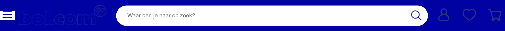

# Procesverslag
Markdown is een simpele manier om HTML te schrijven.  
Markdown cheat cheet: [Hulp bij het schrijven van Markdown](https://github.com/adam-p/markdown-here/wiki/Markdown-Cheatsheet).

Nb. De standaardstructuur en de spartaanse opmaak van de README.md zijn helemaal prima. Het gaat om de inhoud van je procesverslag. Besteedt de tijd voor pracht en praal aan je website.

Nb. Door *open* toe te voegen aan een *details* element kun je deze standaard open zetten. Fijn om dat steeds voor de relevante stuk(ken) te doen.

## Jij

  
uitwerken voor kick-off werkgroep

  ### Auteur:
  Brianne de Deugd

  #### Je startniveau:
  Rood

  #### Je focus:
  Responsive
 

## Je website

  
uitwerken voor kick-off werkgroep

  ### Je opdracht:
  link naar de website die je gaat namaken óf de naam/omschrijving van je eigen ontwerp

  #### Screenshot(s) van de eerste pagina (small screen): 
  BOL.COM - homepagina  
  

  #### Screenshot(s) van de tweede pagina (small screen):
  BOL.COM - elektronica  
  
 

## Toegankelijkheidstest 1/2 (week 1)

  
uitwerken na test in 1e werkgroep

  ### Bevindingen
  Lijst met je bevindingen die in de test naar voren kwamen:

  #### Screenreader
  Op Bol.com zijn er wel heel veel koppen, omdat elke knop (zoals de categorieën) als kop wordt beschouwd. Daardoor duurt het heel lang om te navigeren door de gehele homepagina.

  Koppen kunnen als links worden beschouwd als ze verwijzen naar een andere pagina zoals de categorieën. In dat geval heb je een kop 'categorieën' en kan de gebruiker zelf kiezen of ze deze allemaal opgelezen willen of niet.

  #### Muis en Toetsenbord 
  Met tab kan je op bol.com alles selecteren, maar er is geen manier om dropdowns 'down' te laten 'droppen'. Ook kan je met tab niet teruggaan, dus als je per ongeluk twee keer op tab kunt heb je geen manier om terug te gaan.

  Tab moet gebruiksvriendelijker dan het nu is. Hoe kan je elementen uitvouwen? Hoe kan je terug? Etc.

  #### Motoriek (shocks, elastiekjes)
  Door de shocks duurde het heel lang om de vinger op de juiste knop te krijgen. Je bent constant bezig met wat er gebeurt in je lichaam, waardoor je focus verliest als het gaat om het behalen van je doel, je wordt tegengehouden van de dingen die je wil doen.

  Hier een omschrijving van hoe het opgelost kan worden (met indien nodig afbeeldingen)

  #### Visueel (brillen, contrast, kleurenblind, dark/light). 
  Hemifield Loss - je denkt alles te zien, maar dat is niet zo. In eerste instantie lijkt het of er geen verschil is. Maar je mist van alles.

  Peripheral Field Loss - je kijkt eigenlijk letterlijk door een notendop, dus in plaats van dat je je ogen beweegt, moet je wel je hoofd bewegen. Bol heeft veel grote elementen met tekst die over een groot deel van de breedte spreid, waardoor je beter en langer moet lezen. Dit kan opgelost worden door meer gebruik te maken van kolommen.

  Low Contrast - geeft veel hoofdpijn, en laat alleen globale kleuren zien. Wel heb je soms roze vlakken met blauwe tekst erop, dat is nauwelijks te lezen. 

  Al in al kunnen er meer kolommen gebruikt worden zodat meer elementen in één opslag te vinden/bekijken zijn. Ook mag het contrast veel hoger in geval van kleurenblindheid.

## Breakdownschets (week 1)

  
uitwerken na afloop 2e werkgroep

  ### de hele pagina: 
  

  ### dynamisch deel (bijv menu): 
  

  ### wellicht nog een dynamisch deel (bijv filter): 
  

## Voortgang 1 (week 2)

uitwerken voor 1e voortgang

  ### Stand van zaken
  Flexbox en order ging goed. Ook scrollen binnen containers, custom forms etc.
  
  
  

  ### Agenda voor meeting

  | Brianne                        | Taurese                  | Lars H.                  | student 4                |
  | ---                            | ---                      | ---                      | ---                      |
  | Ik kan niet altijd :nth-of-    | Wil een li veranderen    | Wat is de beste start    | ...                      |
  | child gebruiken. Bijv. als ik  | dmv een timer            | voor het css'en?         | ...                      |
  | de 1e section een background-  |                          |                          | ...                      |
  | image wil geven. Wat moet ik   |                          |                          | ...                      |
  | dan doen? (zelfde met links)   |                          |                          | ...                      |        

  ### Verslag van meeting
  hier na afloop snel de uitkomsten van de meeting vastleggen

  - Het is gelukt om meer met specifiekere selectoren te doen, zoals :first-of-type en '>' om directe kinderen te selecteren.

## Voortgang 2 (week 3)

  
uitwerken voor 2e voortgang

  ### Stand van zaken
  Ik ben heel blij met hoe mijn hamburger-menu is geworden:
  
  En ik ben ook trots op mijn footer:
  
  Ik vind dat de spacing hier echt goed is gelukt en dat het er netjes uitziet! Ook ben ik denk ik goed bezig geweest met nieuwe dingen
  zoals ":not(:first-of-type):"
  

  ### Agenda voor meeting
  samen met je groepje opstellen

  Brianne:
  Ik loop nu tegen kleine dingen aan, zoals de ruimte onder mijn header+ de alignment van de 'ontdek meer' knop. Daarnaast weet ik niet waar ik moet beginnen met de toggle van het onderste menu.

  Taurese:
  Wil weten hoe je een dropdown in een footer plaatst.

  ### Verslag van meeting
  hier na afloop snel de uitkomsten van de meeting vastleggen

  - punt 1
  - punt 2
  - nog een punt
  - ...

## Toegankelijkheidstest 2/2 (week 4)

  
uitwerken na test in 8e werkgroep

  ### Bevindingen
  Lijst met je bevindingen die in de test naar voren kwamen (geef ook aan wat er verbeterd is):

  #### Screenreader
  Je website gaat hierarchies van onder naar boven met de reader. Eerst het logo, dan hamburger menu, de Items in het hamburger menu, de header links (de logo’tjes), zoekbalk input, zoek logo dingetje om je zoekopdracht te zoeken. Kies een categorie (kop niveau twee zegt hij) hij leest dat niet voor (kies een categorie/ shop de look, ontdek alles bij bol). Alt bij afbeeldingen missen niet dat gaat goed. Ontdek alle looks (wat betekent dat Bri?), Bij ontdek alles bij bol: alle kopjes zoals boek / muziek film games. Service & contact leest hij niet voor, meld je aan leest hij als enige voor.

  Hier een omschrijving van hoe het opgelost kan worden (met indien nodig afbeeldingen)

  #### Muis en Toetsenbord 
  Tabs & Muis

  Tabjes - pagina 1: In het begin is het nog niet duidelijk genoeg als je met de tabjes start. Hij begint bij je logo en dan gaat hij naar je menu. Het duurt 8 tabs voor je de andere icoontjes krijgt. De header pakt hij niet qua active state. Kies een categorie, shop de look en ontdek alles bij bol selecteert hij goed. Alles in de footer pakt hij ook met tabben. Tabben door je hamburger menu gaat gemakkelijk. 
  Tabjes -  pagina 2: De tab pagina werkt op alle linkjes, ook de hamburger menu, zelfde verhaal als pag 1. 

  Met muis  - pagina 1: 
  Klikken op het menu gaat gemakkelijk. Alleen het sluiten, de sluitknop (het kruisje) zit niet op dezelfde hoogte. Alle linkjes op je site reageren nog niet als states, maar je ziet wel dat de curser in een handje veranderd dus dat is goed. Alleen nu nog wat verduidelijken. Verder zie ik geen states uitgewerkt, die moeten nog toegevoegd worden. 
  Met muis - pagina 2: Zelfde verhaal als pag 1.

  Dark mode & kleuren

  Dark mode - pagina 1: Heeft geen dark mode, moet nog toegevoegd worden. 
  Dark mode - pagina 2:  Heeft geen dark mode, moet nog toegevoegd worden. 

  Kleuren testen - pagina 1:  Bol heeft al de juiste kleuren, misschien met states dat je daar extra op kan letten als je het kleurtje veranderd / toevoegd. 
  Kleuren testen - pagina 2: Blue Cone Monochromacy / Achromatomaly (De gele knop heeft minder contrast). Bij Monochromacy / Achromatopsia (Hierbij is het contrast werkelijk minder, hier zou je naar kunnen kijken, niet per se nodig. Blue-Blind / Tritanopia (Hierbij lijkt het blauw allemaal een beetje hetzelfde).

  Wat ik hiermee ga doen:

  #### Motoriek (shocks, elastiekjes)
  Hier korte omschrijving (met indien nodig afbeeldingen)

  Hier een omschrijving van hoe het opgelost kan worden (met indien nodig afbeeldingen)

  #### Visueel (brillen, contrast, kleurenblind, dark/light). 
  Hier korte omschrijving (met indien nodig afbeeldingen)

  Hier een omschrijving van hoe het opgelost kan worden (met indien nodig afbeeldingen)

## Voortgang 3 (week 4)

  
uitwerken voor 3e voortgang

  ### Stand van zaken
  Ik ben trots op het feit dat ik mijn nav bar responsive heb gemaakt met grid!
  
  

  ### Agenda voor meeting
  samen met je groepje opstellen

  Brianne: ik wil graag weten hoe ik iconen (images) verander als de grootte van mijn scherm verandert met JavaScript en Css, en of het semantisch correct is om meerdere p’s onder elkaar te hebben of dat daar een andere mogelijkheid voor is. Als laatste wil ik mijn foto’s en tekstgroottes responsive maken.

  Taurese: Ik weet niet hoe ik de header die we in de les hebben gemaakt er goed uit kan laten zien op de desktop versie. En dat mijn navigatie voor een of andere reden niet opent op mijn tweede pagina desondanks de code precies hetzelfde is (css & javascript)

  ### Verslag van meeting
  hier na afloop snel de uitkomsten van de meeting vastleggen

  - punt 1
  - punt 2
  - nog een punt
  - ...

## Eindgesprek (week 5)

  
uitwerken voor eindgesprek

  ### Je uitkomst - karakteristiek screenshots:
  

  ### Dit ging goed/Heb ik geleerd: 
  Korte omschrijving met plaatjes

  

  ### Dit was lastig/Is niet gelukt:
  Korte omschrijving met plaatjes

  

## Bronnenlijst

  
continu bijhouden terwijl je werkt

  Nb. Wees specifiek ('css-tricks' als bron is bijv. niet specifiek genoeg).

  1. bron 1
  2. bron 2
  3. ...

